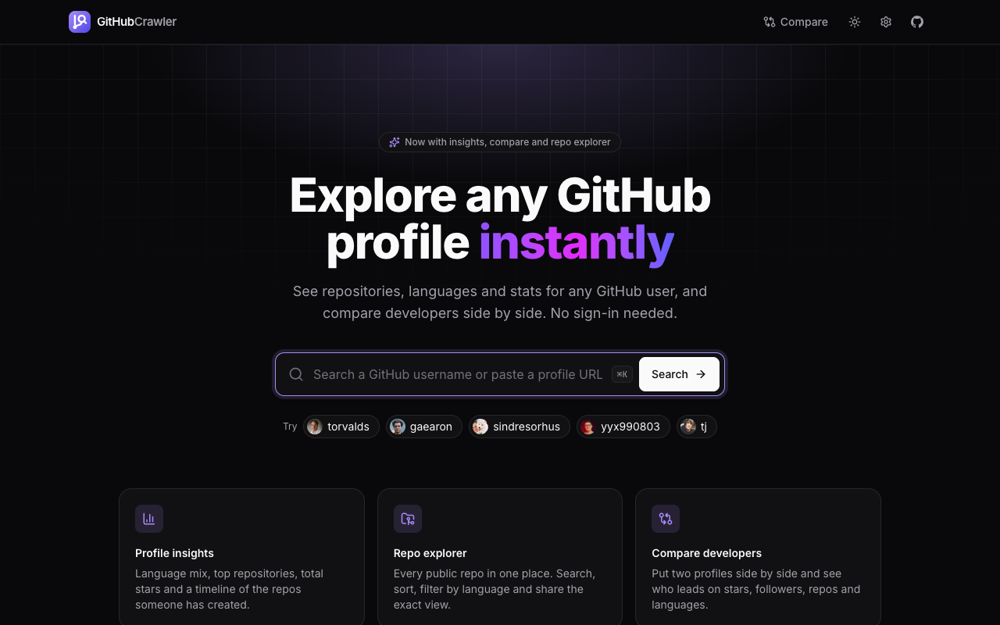
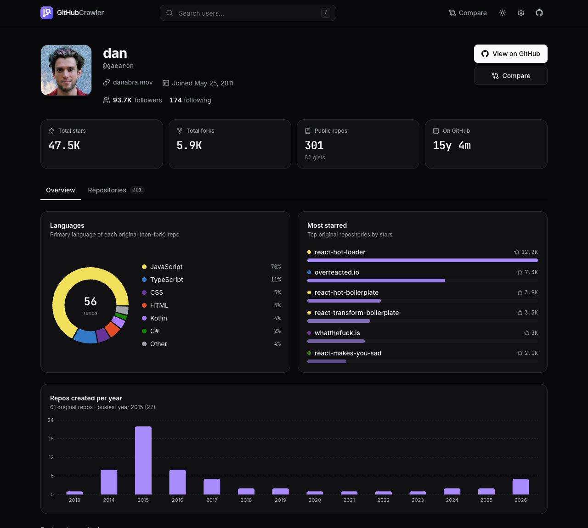
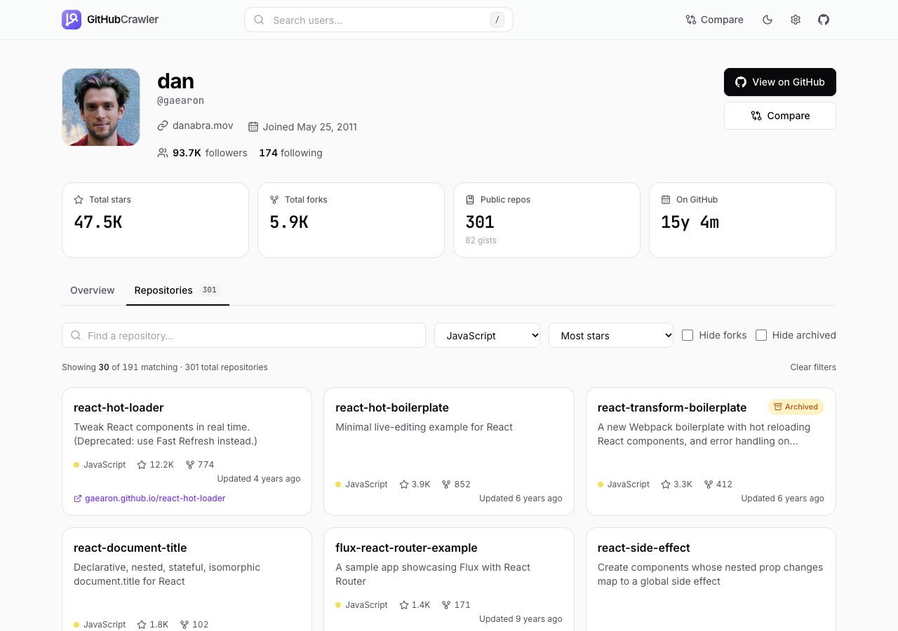
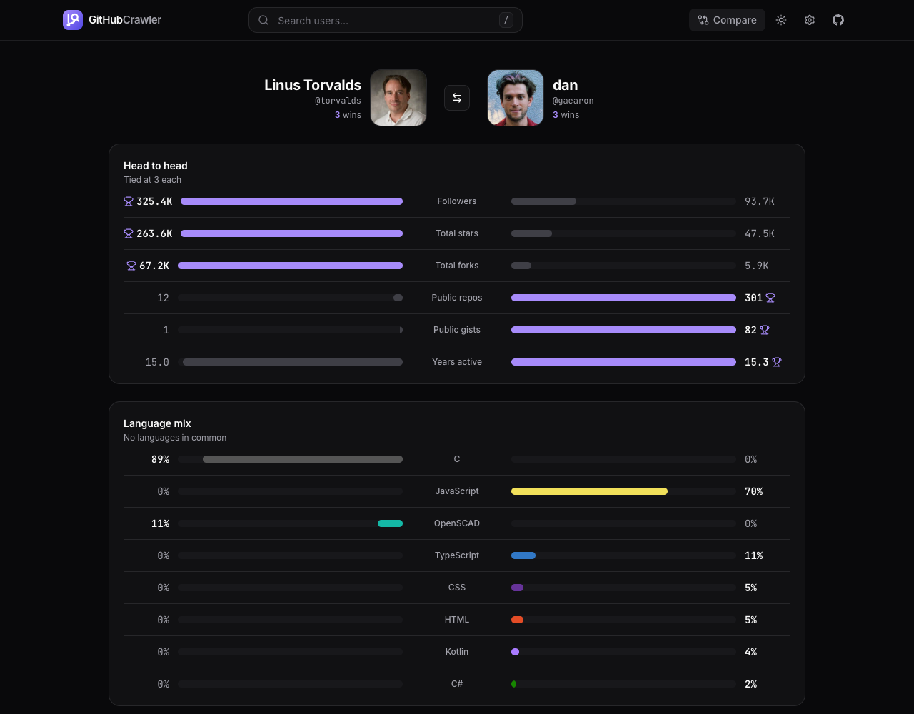
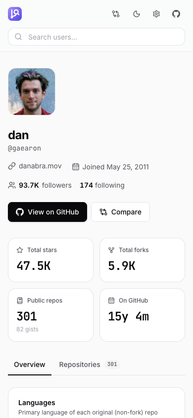

<p align="center">
  
</p>

<h1 align="center">GitHubCrawler</h1>

<p align="center">
  Explore any GitHub profile: stats, languages, every repository, and head-to-head comparisons.
  <br />
  No sign-in, no backend. Just the public GitHub API.
</p>

<p align="center">
  
  
  
  
</p>



## Features

### Profile insights
Total stars and forks, account age, a language breakdown, the most-starred repositories, and a chart of repos created per year.



### Repository explorer
All public repos (up to 500, not just the first 30), with:
- text search across names, descriptions and topics
- sort by stars, recently updated, forks or name
- a language filter
- toggles to hide forks and archived repos

Filters are kept in the URL, so you can share an exact view, e.g. `/user/gaearon?tab=repositories&lang=JavaScript`.



### Compare developers
`/compare/torvalds/gaearon` puts two profiles head to head: followers, stars, forks, repos, gists and years active, with each metric's leader highlighted, plus a side-by-side language mix. One click swaps the two users.



### And more
- **Shareable links** for every profile, tab and filter.
- **Recent searches**, shown as chips on the home page and in the compare picker.
- **Light and dark themes.** The default follows your OS, and a manual choice is remembered.
- **Keyboard search.** Press `/` or `⌘K` / `Ctrl K` to jump to the search box. You can also paste a full `github.com/...` URL.
- **Responsive**, down to phone width.

<p align="center"></p>

## GitHub API rate limit

Unauthenticated requests are limited to **60 an hour** per IP address. One profile takes about 2–6 requests. GitHubCrawler keeps within the limit by:

- caching responses for the browser session, so going back or reloading doesn't use requests
- showing the remaining quota in the footer
- explaining the limit when it's reached and showing when it resets

To raise the limit to **5,000 an hour**, open ⚙️ **API settings** and paste a [fine-grained personal access token](https://github.com/settings/personal-access-tokens/new). It needs no permissions, because everything the app reads is public. The token is stored only in your browser's `localStorage` and is sent only to `api.github.com`.

## Getting started

Requires Node.js 22.12 or newer.

```bash
npm install
npm run dev      # http://localhost:3000
```

| Script | What it does |
|---|---|
| `npm run dev` | Start the dev server with hot reload |
| `npm test` | Run unit and component tests (Vitest + Testing Library) |
| `npm run lint` | Lint with ESLint |
| `npm run build` | Type-check and build to `dist/` |
| `npm run preview` | Serve the production build locally |

## Tech stack

- **UI:** React 19, TypeScript, Tailwind CSS v4, lucide-react icons, Recharts
- **Routing and data:** React Router 7, TanStack Query 5 (cache persisted to `sessionStorage`)
- **Tooling:** Vite 8, Vitest, Testing Library, ESLint 9

## Project layout

```
src/
  app/          providers, router, layout (header and footer)
  pages/        HomePage, UserPage, ComparePage, NotFoundPage
  features/
    search/     search bar, recent searches
    profile/    header, stat tiles, charts, repo card
    repos/      repo explorer, filter and sort logic
    compare/    compare picker, metric bars, language mix
    settings/   API token dialog, theme toggle
  components/   shared UI primitives (Button, Card, Tabs, Dialog, …)
  lib/          GitHub API client, types, stats, formatting, storage
  hooks/        useUser, useRepos, useRateLimit, useTheme
```

## Deploying

It's a static single-page app. Build with `npm run build` and serve `dist/`.

`vercel.json` already rewrites every path to `index.html`, so deep links like `/user/torvalds` work on Vercel. On other hosts (Netlify, Cloudflare Pages, nginx), configure an equivalent fallback to `index.html`.

## Author

Built by [Bishal De](https://bishalde.vercel.app).
